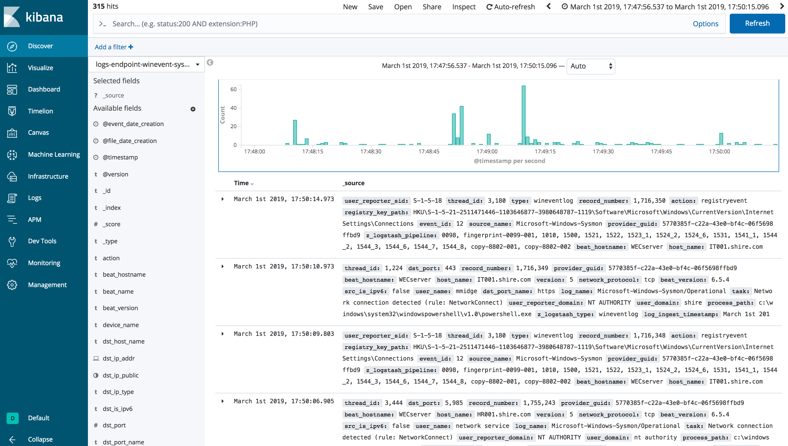

# Mordor Gates

The Mordor project provides pre-recorded security events generated by simulated adversarial techniques in the form of JavaScript Object Notation (JSON) files for easy consumption. The pre-recorded data is categorized by platforms, adversary groups, tactics and techniques defined by the Mitre [ATT&CK Framework](https://attack.mitre.org/wiki/Main_Page). The pre-recorded data represents not only specific known malicious events but additional context/events that occurs around it. This is done on purpose to be able to test creative correlations across diverse data sources enhancing your detection strategy and potentially reducing the number of false positives in your own environment.

The name **Mordor** comes from the awesome film series "[The Lord of the Rings](https://en.wikipedia.org/wiki/The_Lord_of_the_Rings_(film_series))", and it was a place where the evil forces of [Sauron](https://en.wikipedia.org/wiki/Sauron) lived. This repository is where data generated by known "malicious" adversarial activity lives, hence the name of the project :wink: .


# Goals

* Provide free portable malicious datasets to expedite the development of data analytics.
* Expedite adversarial techniques simulation and output consumption.
* Allow security analysts to test their skills with real known bad.
* Improve the testing of hunting use cases and data analytics in an easier and more affordable way.
* Enable data scientists to have semi-labeled data for initial research.
* Map threat hunter playbooks to their respective pre-recorded data for validation purposes.
* Contribute to the [ATT&CK framework](https://attack.mitre.org/wiki/Main_Page) **Data Sourcess** section of each technique and sub-technique.
* Expedite data ingestion of known bad for training and capture the flag (CTF) events.
* Learn more about red team simulation exercises and technology such as Kafkacat, Kafka and Jupyter Notebooks.

# Getting Started

* How to Consume Mordor Data?
    * [Kafkacat Style]()
    * [Jupyter Notebooks Style]()
* Simulated Environment
    * [Network Design]()
    * [Network Configurations]()
    * [Data Collection Strategy]()

# How to Consume Mordor Data?


You can simply download the json files available in this repo and start using some grep fu! if you feel like it. However, there are other more efficient ways you can consume the pre-recorded data and even simulate a real data pipeline to ingest the data to your own SIEM or data lake.


## Kafkacat Style

You can start using a tool named Kafkacat to act as a Kafka producer and send data to Kafka brokers. You can just grab the logs from this repo and re-play the data as if it was being ingested in real-time.

### Requirements

* [Kafka Broker](http://kafka.apache.org/) : A distributed publish-subscribe messaging system that is designed to be fast, scalable, fault-tolerant, and durable.
* [Kafkacat](https://github.com/edenhill/kafkacat) : A generic non-JVM producer and consumer for Apache Kafka >=0.8, think of it as a netcat for Kafka.
* [ELK (Optional)](https://www.elastic.co/elk-stack) : An elastic ELK (Elasticsearch, Logstash, Kibana) stack.

### Consume Logs

You can start by installing Kafkacat following the [instructions from the official Kafkacat repo](https://github.com/edenhill/kafkacat#install).

Download and run the [HELK](https://github.com/Cyb3rWard0g/HELK). Make sure you have enough memory to run the basic build. You can run it with 5-6GB of RAM now (More information [here](https://github.com/Cyb3rWard0g/HELK/wiki/Installation)).

```
git clone https://github.com/Cyb3rWard0g/HELK.git
cd HELK/docker
sudo ./helk_install
```

Use the defaults (Option 1 and Basic license)

```
**********************************************
**          HELK - THE HUNTING ELK          **
**                                          **
** Author: Roberto Rodriguez (@Cyb3rWard0g) **
** HELK build version: v0.1.7-alpha02262019 **
** HELK ELK version: 6.6.1                  **
** License: GPL-3.0                         **
**********************************************
 
[HELK-INSTALLATION-INFO] HELK being hosted on a Linux box
[HELK-INSTALLATION-INFO] Available Memory: 12541 MBs
[HELK-INSTALLATION-INFO] You're using ubuntu version xenial
 
*****************************************************
*      HELK - Docker Compose Build Choices          *
*****************************************************
 
1. KAFKA + KSQL + ELK + NGNIX + ELASTALERT
2. KAFKA + KSQL + ELK + NGNIX + ELASTALERT + SPARK + JUPYTER
 
Enter build choice [ 1 - 2]: 1
[HELK-INSTALLATION-INFO] HELK build set to 1
[HELK-INSTALLATION-INFO] Set HELK elastic subscription (basic or trial): basic
[HELK-INSTALLATION-INFO] Set HELK IP. Default value is your current IP: 192.168.64.138
[HELK-INSTALLATION-INFO] Set HELK Kibana UI Password: hunting
[HELK-INSTALLATION-INFO] Verify HELK Kibana UI Password: hunting
[HELK-INSTALLATION-INFO] Installing htpasswd..
[HELK-INSTALLATION-INFO] Installing docker via convenience script..
[HELK-INSTALLATION-INFO] Installing docker-compose..
[HELK-INSTALLATION-INFO] Checking local vm.max_map_count variable and setting it to 4120294
[HELK-INSTALLATION-INFO] Building & running HELK from helk-kibana-analysis-basic.yml file..
```

Download this repo and choose your technique:

```
cd ../../
git clone https://github.com/Cyb3rWard0g/mordor.git
cd mordor/atomic_logs/windows/credential_access/credential_dumping/dcsync
```

Decompress the log file

```
tar -xzvf empire_dcsync.tar.gz
x empire_dcsync_2019-03-01174830.json
```

Send the data to HELK via Kafcakat with the following flags:

* -b : Kafka Broker
* -t : Topic in the Kafka Broker to send the data to
* -P : Producer mode
* -l : Send messages from a file separated by delimiter, as with stdin. (only one file allowed)

```
kafkacat -b <HELK IP>:9092 -t winlogbeat -P -l empire_dcsync_2019-03-01174830.json
```

Browse to your Kibana Discover view and start going through the data :beers:



## Jupyter Notebook Style

You can consume the data from this repo via a Jupyter notebook and use python libraries such as Pandas to explore and analyze the data in a scientific way.

### Requirements

* [Jupyter Notebook](https://jupyter.org/) : an open-source web application that allows you to create and share documents that contain live code, equations, visualizations and narrative text.

### Consume Logs

You can Install a **Jupyter Notebook** server locally by following the [official Jupyter instructions](https://jupyter.org/install) or deploy it via docker with the following commands:

```

```

Start Jupyter Lab by running the following commands in the root directory of this repo. This will allow you to access the json files via Jupyter notebooks.

```

```

# Projects Using Mordor

* [ThreatHunter-Playbook](https://github.com/Cyb3rWard0g/ThreatHunter-Playbook)
* [HELK](https://github.com/Cyb3rWard0g/HELK)

# Authors

* Roberto Rodriguez [@Cyb3rWard0g](https://twitter.com/Cyb3rWard0g)
* Jose Luis Rodriguez [@Cyb3rPandaH](https://twitter.com/Cyb3rPandaH)

# Contributors

# Contributing

There are a few things that we would like to accomplish with this repo as shown in the To-Do list below. If you want to learn how to record your own data and share it with the community, you can follow the following instructions in the Wiki of the project. Share your pre-recorded data with us following  our same setup, and help others in the Cyber community to validate their detection use cases in a faster and easier way.  

# License: GPL-3.0

[ Mordor's GNU General Public License](https://github.com/Cyb3rWard0g/Mordor/blob/master/LICENSE)

# To-Do

- [ ] SMB-Client Log Provider
- [ ] Bro (Zeek) Logs
- [ ] MacOS & Linux pre-recorded events
- [ ] Share Terraform & Packer config files to deploy the same environment in the cloud
- [ ] Read the docs integration :wink:

More coming soon...